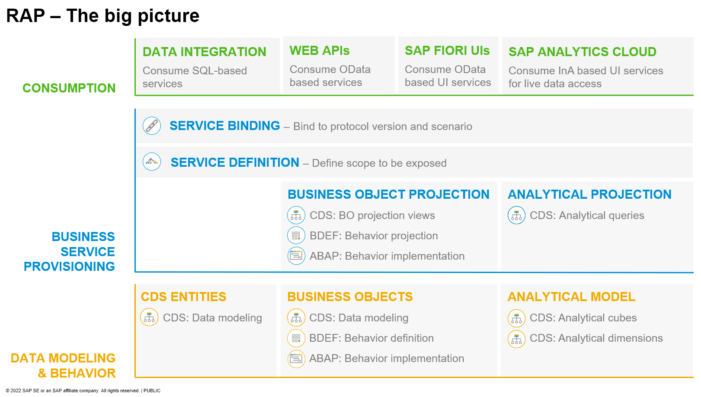

# DT281 - Build and Extend Apps with the ABAP RESTful Application Programming Model (RAP)

## Description

Want to build modern, cloud-ready SAP Fiori apps on SAP S/4HANA or create ABAP-based side-by-side extensions on SAP Business Technology Platform? Then the ABAP RESTful application programming model is the right choice for you.

## Overview

This session introduces attendees to the ABAP RESTful Application Programming Model (RAP) which is available on SAP BTP ABAP Environment, SAP S/4HANA, and SAP S/4HANA Cloud.

#### About the ABAP RESTful Application Programming Model
  > The ABAP RESTful Application Programming Model (RAP) is a set of concepts, tools, languages, and powerful frameworks provided on the ABAP platform. It supports the efficient development of innovative and cloud-ready enterprise applications, as well as the extension of SAP standard applications in an upgrade-stable way in the cloud and on-premise.

Click to expand!

> RAP is an enabler for improving the user experience and innovating business processes in ABAP-based SAP solutions by leveraging SAP Fiori, SAP HANA, and the cloud. 
> It is a long-term strategic solution for ABAP development on SAP’s flagship product SAP S/4HANA, in the cloud and on-premise (as of release 1909), as well as on the SAP BTP ABAP Environment.

>
> The illustration below shows the high-level end-to-end development stack when working with RAP.  
> 
> 
> 
> **Read more**: [Modernization with the ABAP RESTful Application Programming Model (RAP)](https://blogs.sap.com/2021/10/18/modernization-with-rap/)

## Requirements

The requirements to follow the exercises in this repository are:
1. [Install the latest Eclipse platform](https://www.eclipse.org/downloads/packages/installer)	
2. [Install the latest ABAP Development Tools (ADT) plugin](https://tools.eu1.hana.ondemand.com/#abap) 
3. [Create an user on the SAP BTP ABAP Environment Trial](https://developers.sap.com/tutorials/abap-environment-trial-onboarding.html)

## Exercises

Start the exercises [here](https://github.com/SAP-samples/abap-platform-rap-workshops/tree/main/rap1xx/rap100#exercises).

## How to obtain support

Support for the content in this repository is available during the actual time of the online session for which this content has been designed. Otherwise, you may request support via the [Issues](../../issues) tab.

## License
Copyright (c) 2022 SAP SE or an SAP affiliate company. All rights reserved. This project is licensed under the Apache Software License, version 2.0 except as noted otherwise in the [LICENSE](LICENSES/Apache-2.0.txt) file.
